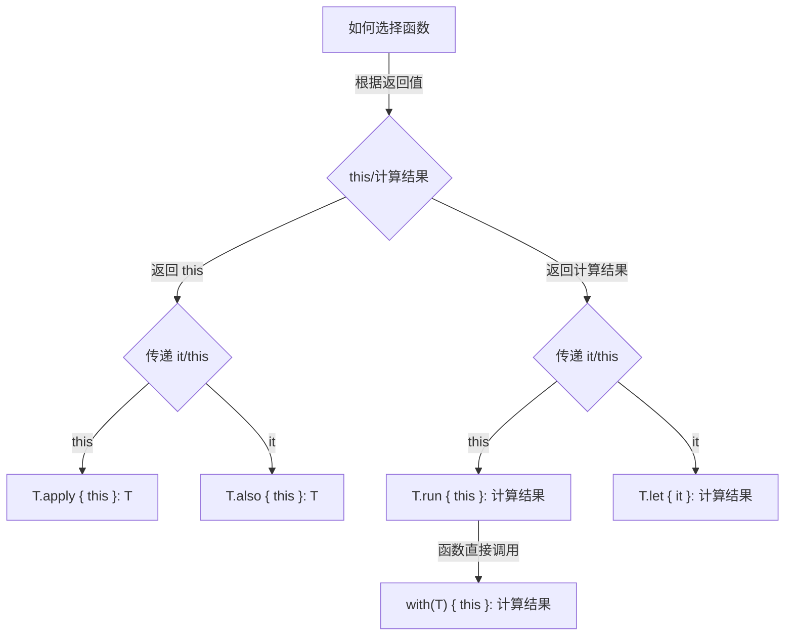

# 简单介绍

## 定义包

包的声明应处于源文件顶部：

```kotlin
package my.demo
import java.util.*
//...
```

目录与包的结构无需匹配：源代码可以放在文件系统的任意位置。

## 定义函数

带有两个`Int`参数，返回`Int`函数：

```kotlin
fun sum (a:Int,b:Int):Int{
    return a+b
}
```

<!-- more -->

将表达式作为函数体，返回值类型自动推送的函数：

```Kotlin
fun sum (a:Int,b:Int) = a + b
```

函数返回无意义的值：

```kotlin
fun printSum(a:Int,b:Int){
	println("sum $a and $b is ${a+b}")
}
```

`Unit`返回类型可以省略：

```Kotlin
fun printSum(a:Int,b:Int){
    println("sum of $a and $b is ${a+b}")
}
```

## 定义变量

定义**只读局部变量**使用关键字`val`定义。只能为其赋值一次。

```kotlin
val a:Int = 1	//立即赋值
val b = 2		//自动推出‘Int’类型
val c:Int		//如果没有赋初值，则不能省略
c = 2			//明确赋值
```

可重新赋值的变量使用`var`关键字：

```kotlin
var x = 5
x += 1
```

顶层变量：

```kotlin
val PI = 3.14
var x = 0
```

## 注释

正如Java，Kotlin支持行注释及块注释。

```kotlin
// 这是一个行注释
/* 这是一个多行的
   块注释。*/
```

与Java不同的是，Kotlin的块注释可以嵌套。
## 使用字符串模板

使用字符串模板的符号为（`$`）。在`$`符号后面加上变量名或大括号中的表达式

```kotlin
var a = 1

val s1 = "a is $a"
// 模板中的简单名称

a = 2
val s2 = "${s1.replace("is","was")},but now is $a"
//模板中的任意表达式

println(s2)
```

执行结果：

```
a was 1, but now is 2
```
## 声明可空变量

在Kotlin中当我们不确定某个属性或变量一定不为空时，我们就把它声明为**可空变量**.

可空变量的特点：

+ 在声明的时候一定要用标准的声明格式定义。不能用可推断类型的简写；
+ 变量类型后面的`?`符号不能省略。不然就和普通的变量没区别了；
+ 其初始化的值可以为`null`或确定的变量值。

```kotlin
class Test{
    //声明可空变量
    var a:Int? = 0;
    val b:Int? = null;
}
```
## 常量的用法

在Kotlin中`val`修饰的还不是常量，他只是个不能修改的变量。常量的定义还需要再`val`关键字前加上`const`关键字。即：

```kotlin
const val NUM_A = 6
```

其特点：**`const`只能修饰`val`，不能修饰`var`**。

声明常量的三种方式：

1. 在顶层声明；
2. 在`object`修饰的类中声明，在`kotlin`中称为**对象声明**；
3. 在伴生对象中声明。

例如：

```kotlin
// 1.顶层声明
const val Str_A :String = "顶层声明"

// 2.在object修饰的类中
object TestConst{
    const val Str_B = "object修饰的类中"
}
// 3.在伴生对象中
class TestClass{
    companion object{
        const val Str_C = "在伴生对象中"
    }
}
```

# 数据类型

## 数值类型

### 1. 数字的内置类型

+ `Byte ` => 字节 => 8位
+ `Short` => 短整型 => 16位
+ `Int` => 整型 => 32位
+ `Long` => 长整型 => 64位
+ `Float` => 浮点型 => 32位
+ `Double` => 双精度浮点型 => 64位

注意：

+ 长整型在数值末用大写字母L标记
+ 单精度浮点型由字母F（大写小写无妨）标记
### 2. 进制数

Kotlin不支持八进制数

### 3. 数字类型字面常量的下划线

作用：**分割数字进行分组，使数字常量更易读**

例如：

```kotlin
val oneMillion = 1_000_000
val phoneNum = 155_0746_2014
```

### 4. 装箱与拆箱

装箱就是值类型转换为object类型，拆箱相反：object转化为值类型。在`kotlin`中，存在数字的装箱，但是没有拆箱。因为`kotlin`是没有基本数据类型的，`Kotlin`是万物皆对象的原则。

在`kotlin`中要实现装箱操作，首先要了解可空引用。即类似`Int?`(只限数值类型)此类的：

 ```kotlin
val numValue:Int = 1
// 装箱的过程，装箱后其值是没有变化的
val numValueBox:Int = numValue
 ```

#### 两个数值的比较

+ 判断两个数值是否相等`==`
+ 判断两个数值在内存中的地址是否相等`===`

### 5. 转换

+ 显式转换

  较小的类型不会被隐式转换位更大的类型，故而系统提供了显式转换：

  + `toByte()` => 转换为字节型
  + `toShort()` => 转换为短整型
  + `toInt()` => 转换为整型
  + `toLong()` => 转换为长整型
  + `toFloat()` => 转换为浮点型
  + `toDouble()` => 转换为双精度浮点型
  + `toChar()` => 转换为字符型
  + `toString()` => 转换为字符串型

+ 隐式转换

  类型是从上下文推断出来的，即算术运算则被重载为适当的转换：

  ```kotlin
  val num = 30L + 12
  println(num)
  // 30L + 12 -> Long + Int => Long
  ```

### 6. 位运算符

// 。。。。。

## 布尔类型

### 1. 关键字

`Boolean`关键字表示布尔类型，并且其值有`ture`和`false`

```kotlin
var isNum:Boolean
isNum = false
```

### 2. 逻辑操作符

+ ‘||’ => 逻辑或
+ '&&' => 逻辑与
+ ‘ ! ’ => 逻辑非

## 字符型

### 1. 关键字

`Char`表示字符型，字符变量用单引号('')表示。并且不能直接视为数字，不过可以通过显式转换为数字：

```kotlin
var char_1:Char
char = 'a'
char = 1	//报错
```

### 2. 显示转换为其他类型

字符型的变量不仅会可以转换为数字，同时也可转换为其他类型：

```kotlin
var var1 = char_1.toByte()
var var2 = char_1.toInt()
//...
```

除了类型转换，当变量为英文字母时还支持大小写转换：

```kotlin
var charA:Char = 'a'
var charB:Char = 'B'
var result:Char

result = charA.toUpperCase()	//转换为大写
result = charB.toLowerCase()	//转换为小写
```

### 3. 字符转义

+ `\t` => 制表符
+ `\n` => 换行符
+ `\b`=> 退格键
+ `\r`=> 回车键
+ `\\`=> 反斜杠
+ `\'`=> 单引号
+ `\$` => 美元符号
+ **其他的任何字符请使用Unicode转义序列语法，例如：'\uFF00'

## 字符串类型

### 1. 关键字

`String`表示字符串类型。其实不可变的。所以字符串的元素可以通过索引操作的字符：`str[index]`来访问。可以使用`for`循环迭代字符串：其中`str[index]`中的`str`要为目标字符串，`index`才能为索引：

```kotlin
val str:Sting = "kotlin"
//迭代
for (s in str){
    print(s)
    print("\t")
}
```

### 2. 字符串字面量

在`Kotlin`中，字符串字面量有两种类型：

+ 包含转义字符的字符串，转义包括（\t, \n等），不包括转义字符串的也同属此类型
+ 包含任意字符的字符串，有三重引号（`"""..."""`）表示

## 数组型

+ `Kotlin中`数组由`Array<T>表示`
+ 创建数组的三个函数：
  + `arrayOf()`
  + `arrayOfNulls()`
  + 工厂函数（`Array()`）

### 1. arrayOf()

创建一个数组，参数是一个可变参数的泛型对象：

```kotlin
val arr1 = arrayOf(1,2,3,4,5)
for (v in arr1){
    print(v)
    print("\t")
}
```

### 2. arrayOfNulls()

用于创建一个指定数据类型且可以为空元素的，给定元素个数的数组：

```kotlin
var arr2 = arrayOfNulls<Int>(3)
// 若不予数组赋值则arr3内元素皆为null
```

### 3. 工厂函数

+ 使用工厂函数`Array()`，它使用数组大小和返回给定其索引的每个数组元素的初始值的函数。
+ `Array()`=> 第一个参数表示的个数，第二个参数则为使用其下标组成的表达式

``` kotlin
var arr3 = Array(5,{index -> (index*2).toString()})
for (v in arr4){
    print(v)
    print("\t")
}
```

执行结果：

```kotlin
0	2	4	6	8
```

### 4. 原始类型数组

`kotlin`还有专门的类来表示原始类型的数组，没有装箱开销，它们分别是：

+ `ByteArray` => 表示字节型数组
+ `ShortArray` => 表示短整型数组
+ `IntArray` => 表示整型数组
+ `LongArray` => 表示长整型数组
+ `BooleanArray` => 表示布尔型数组
+ `CharArray` => 表示字符型数组
+ `FloatArray` => 表示浮点型数组
+ `DoubleArray` => 表示双精度浮点型数组

**`Kotlin`不支持字符串类型这种原始类型的数组**

```kotlin
var intArr:IntArray = intArrayOf(1,2,3,4,5)

var charArr:CharArray = charArrayOf('a','b','c','1','2')
```

# 控制语句

## if语句

`kotlin`中的`if`语句很灵活，除了普通的判断，还可以实现表达式（实现三元运算符），及作为一个块的作用

### 1. 传统写法

```kotlin
var numA = 2
if (numA == 2){
    println($numA)
}else{
    println($numA-1)
}
```

### 2. `Kotlin`中的三元运算符

在`Kotlin`中其实不存在三元运算符（*condition ？ then ： else*）这种运算，那是因为if语句的特性：`if`表达式会返回一个值，所以不需要三元运算符。

```kotlin
var numB:Int = if (numA > 2) 3 else 5
println(numB)
```

### 3. 作为一个块结构，并且最后一句表达式为块的值

```kotlin
var numA:Int = 2
var numC:Int = if(numA > 2){
    numA = 10
	numA
}else if (numA == 2){
    numA = 20
    numA
}else{
    numA = 30
    numA
}
```

## for语句

+ `for`循环提供迭代器用来遍历任何东西
+ `for`循环数组被编译为一个基于索引的循环，它不会创建一个迭代器对象

### 规则

+ 递增

  + 关键字：`until`

  + 范围：`until[n,m]` => 大于等于n，小于m

  + 例如：

  ```kotlin
  // 循环5次，且步长为1的递增
  for (i in 0 until 5){
      print(i)
  }
  ```

+ 递减

  + 关键字：`downTo`

  - 范围：`downTo[n,m]` => 大于等于n，小于等于m，n > m

  - 例如：

    ```kotlin
    // 循环5次，且步长为1的递减
    for(i in 15 downTo 11){
        print(i)
    }
    ```

+ 符号(`..`)

  表示递增循环的另外一种操作

  + 使用符号`..`

  + 范围：`..[n,m]` => 即`大于等于n,小于等于m`

  + 和`until`有区别，但更为简便，且范围不同

  + 例如：

    ```kotlin
    for (i in 20..25){
        print(i)
    }
    ```

+ 设置步长

  + 关键字：`step`

  + 例如：

    ```kotlin
    for (i in 10 until 16 step 2){
        print(i)
    }
    ```

### 遍历字符串

例如：

```kotlin
for (i in "asdfghjk"){
    print(i)
}
```

### 遍历数组

例如：

```kotlin
var arrayList = arrayOf(1,3,5,7,9)
for (i in arrayList){
    print(i)
}
```

```kotlin
var arrayList = arrayOf(1,3,5,7,9)
for (i in arrayListTwo.indices){
    println("arrayList[$i] => " + arrayList[i])
}
```

```kotlin
var arrayList = arrayOf(1,3,5,7,9)
for ((index,value) in arrayList.withIndex()){
    println("index => $index \t value => $value")
}
```

#### 使用列表或数组的扩展函数遍历

+ 数组或列表有一个成员或扩展函数`iterator()`实现了`Iterator<T>`接口，且该接口提供了`next()`与`hasNext()`两个成员或扩展函数
+ 其一般和`while`循环一起使用

例如：

```kotlin
var arrayList = arrayOf(2,'a',3,false,9)
var iterator: Iterator<Any> = arrayList.iterator()

while (iterator.hasNext()){
    println(iterator.next())
}
```

## when语句

`when`语句类似于C类语言中的`switch`语句，不过比它更强大。

### 实现switch语句功能

```kotlin
when(5){
    1 -> {
        print("1")
    }
    2 -> {
        print("2")
    }
    esle -> {
        print("5")
    }
}
```

### 与逗号结合

```kotlin
when(1){
    // 即值为1，2，3时都输出1
    1,2,3 -> {
        print("1")
    }
    else -> {
        print("0")
    }
}
```

### 条件可以使用任意表达式

```kotlin
var num:Int = 5
when (num > 5){
    true -> {
        print("num > 5")
    }
    false -> {
        print("num < 5")
    }
    else -> {
        print("num = 5")
    }
}
```

### 检查值是否存在于集合或数组中

1. 操作符
   + `in`在
   + `!in`不在

2. 限定：只适用于数值类型

例如：

```kotlin
var arrayList = arayOf(1,2,3,4,5)
when(1){
    in arrayList.toIntArray() -> println("1 存在于arrayList数组中")
    in 0 .. 10 -> println("1 属于0~10中")
    !in 5 ..10 -> println("1 不属于5~10中")
	else -> println("都错了！")
}
```

### 检查值是否为指定类型的值

1. 操作符
   + 是`is`
   + 不是`!is`

2. 注意：`kotlin`的智能转换可以访问类型的方法和属性

例如：

```kotlin
when("abc"){
    is String -> println("是字符串")
    else -> println("不是字符串")
}
//智能转换
var a:Int = 2
when(a){
    !is Int -> println("$a 不是一个整型的数")
    else -> {
        a = a.shl(2)
        println("a => $a")
    }
}
```

### 不使用表达式的when语句

表示为最简单的布尔表达式

```kotlin
var array = arrayOfNulls<String>(3)
when{
    true -> {
        for (i in array){
            print(" $i \t")
        }
        println()
    }
    else -> {
        
    }
}
```

## 其它语句

+ while语句

+ do while语句
+ 跳转语句：return，break，continue

与C类语言一致，不做赘述。

# 操作符

## 一元操作符

### 简单一元

| 操作符 |      重载      |
| :----: | :------------: |
|   +a   | a.unaryPlus()  |
|   -a   | a.unaryMinus() |
|   !a   |    a.not()     |

### 复杂一元

| 操作符 |  重载   |            表示            |
| :----: | :-----: | :------------------------: |
|  a++   | a.inc() |   a = a.also{ a.inc() }    |
|  a--   | a.dec() |   a = a.also{ a.dec() }    |
|  ++a   | a.inc() | a = a.inc().also{ a = it } |
|  --a   | a.dec() | a = a.dec().also{ a = it } |

## 二元操作符

### 简单二元

| 操作符 |    重载     |
| :----: | :---------: |
| a + b  |  a.plus(b)  |
| a - b  | a.minus(b)  |
| a * b  | a.tiems(b)  |
| a / b  |  a.div(b)   |
| a % b  |  a.rem(b)   |
| a .. b | a.rangTo(b) |

### 复杂二元

| 操作符 |   表示    |      重载      |
| :----: | :-------: | :------------: |
| a += b | a = a + b | a = a.plus(b)  |
| a -= b | a = a - b | a = a.minus(b) |
| a *= b | a = a * b | a = a.tiems(b) |
| a /= b | a = a / b |  a = a.div(b)  |
| a %= b | a = a % b |  a = a.rem(b)  |

## 区间操作

区间操作符：`..`，注意两个操作数都是整型

| 操作符 |      表示       |     重载     |
| :----: | :-------------: | :----------: |
| a .. b | a 到 b 中间的值 | a.rangeTo(b) |

# 进阶操作

## 可空类型，空安全

### 定义一个可空类型的变量

> **修饰符 变量名 : 类型? = 值**

### 判断可空类型的两种方式

+ if...else... 判断

+ 使用符号`?.`判断

  该符号的用法为：`可空类型变量?.属性/方法`。如果可空类型变量为null是，返回null；

  这种方法大量用于**链式操作**的用法中，能有效避免`空引用异常`，因为只要链式中有一个`null`，则整个表达式都为`null`。

## 高阶函数

### let

`let` 扩展函数的实际上是一个作用域函数，当你需要去定义一个变量在一个**特定的作用域**范围内，`let` 函数的是一个不错的选择；

```kotlin
obj.let {
    // 用 it 指代 obj 对象
    // todo() 是 obj 对象的共有属性或方法
    // it.todo() 的返回值作为 let 函数的返回值返回
    it.todo() 
}

// 另一种用法
obj?.let {
    it.todo() // obj 不为 null 时才会调用 let 函数
}
```

+ 使用 let 函数处理需要针对一个可 null 的对象统一做判空处理；

+ 需要去明确一个变量所处特定的作用域范围内可以使用；

### with

和 `let` 类似，又和 `let` 不同，`with` 最后也包含一段函数块，也是将最后的计算的结果返回。

但是 `with` 不是以拓展的形式存在的。其将某个对象作为函数的参数，并且以 `this` 指代，可以类比 js 。

```kotlin
whith(obj) {
  // todo() 是 obj 对象的共有属性或方法
  // todo() 的返回值作为 with 函数的返回值返回
  todo() 
}
```

如果我们使用 `with` 函数的话，由于代码块中传入的是 `this`，而不是 `it`，那么我们就可以直接写出函数名（属性）来进行相应的设置：

```kotlin
if (textView == null) return
with(textView) {
	text = "TextSetInTextView"
	setTextColor(ContextCompat.getColor(this@TestActivity, R.color.colorAccent))
	textSize = 18f
}
```

这段代码唯一的缺点就是要事先判空了，有没有既能像 let 那样能优雅的判空，又能写出这样的便利的代码呢？

### run

刚刚说到，我们想能有 `let` 函数那样又优雅的判空，又能有 `with` 函数省去同一个对象多次设置属性的便捷写法。

没错，就是这就非我们 `run` 函数莫属了。`run` 函数基本是 `let` 和 `with` 的结合体，对象调用 `run` 函数，接收一个 `lambda` 函数为参数，传入 `this` 并以闭包形式返回，返回值是最后的计算结果。

```kotlin
obj.run {
  // todo() 是 obj 对象的共有属性或方法
  // todo() 的返回值作为 run 函数的返回值返回
  todo() 
}
```

那么上面 TextView 设置各种属性的优化写法就是这样的：

```kotlin
textView?.run {
	text = "TextSetInTextView"
	setTextColor(ContextCompat.getColor(this@TestActivity, R.color.colorAccent))
	textSize = 18f
}
```

像上面这个例子，在需要多次设置属性，但设置属性后返回值不是该对象（或无返回值：Unit）不能链式调用的时候，就非常适合使用 `run` 函数。

### apply

`apply` 函数和 `run` 函数很像，但是 `apply` 最后返回的是调用对象自身。

```kotlin
val result = obj.apply {
  // todo() 是 obj 对象的共有属性或方法
  todo() 
  3 * 4 // 最后返回的是 obj 对象，而不是 12
}

println(result) // 打印的是 obj 对象
```

由于 `apply` 函数返回的是调用对象自身，我们可以借助 `apply` 函数的特性进行多级判空。

### also

和 `let` 函数类似，唯一的区别就是 `also` 函数的返回值是调用对象本身：

```kotlin
val result = obj.also {
    // 用 it 指代 obj 对象
    // todo() 是 obj 对象的共有属性或方法
    it.todo() 
  	3 * 4 // 将返回 obj 对象，而不是 12
}
```

#### 总结

函数定义见下表：

| 函数名 | 实现                                                         |
| ------ | ------------------------------------------------------------ |
| let    | public inline fun <T, R> T.let(block: (T) -> R): R = block(this) |
| with   | public inline fun <T, R> with(receiver: T, block: T.() -> R): R = receiver.block() |
| run    | public inline fun <T, R> T.run(block: T.() -> R): R = block() |
| apply  | public inline fun  T.apply(block: T.() -> Unit): T { block(); return this } |
| also   | public inline fun T.also(block: (T) -> Unit): T { block(this); return this } |

具体的调用情况见下图：



# 面向对象

kotlin 中的类成员包括：构造函数、初始化代码块、成员函数、属性、**内部类和嵌套类**、以及**对象表达式声明**。

## 构造函数

+ 在 Kotlin 中的一个类可以有一个**主构造函数**以及一个或多个**次构造函数**，主构造函数是类头的一部分：它跟在类名（与可选的类型参数）后；

+ 如果主构造函数没有任何注解或者可见性修饰符，可以省略这个 *constructor* 关键字：

  ```kotlin
  class Person constructor(firstName: String) { /*……*/ }
  class Person(firstName: String) { /*……*/ }
  ```

+ 主构造函数不能包含任何的代码。初始化的代码可以放到以 *init* 关键字作为前缀的**初始化块（initializer blocks）**中，主构造的参数可以在初始化块中使用。它们也可以在类体内声明的属性初始化器中使用：

  ```kotlin
  class Person constructor(firstName: String) {
      var name = firstName
      init {
          println("name: ${firstName}")
      }
  }
  ```

+ 类也可以声明前缀有 *constructor*的**次构造函数**，每个次构造函数需要委托给主构造函数， 可以直接委托或者通过别的次构造函数间接委托。委托到同一个类的另一个构造函数用 ***`this`*** 关键字即可；

+ 初始化块中的代码实际上会成为主构造函数的一部分。委托给主构造函数会作为次构造函数的第一条语句，因此所有初始化块与属性初始化器中的代码都会在次构造函数体之前执行。即使该类没有主构造函数，这种委托仍会隐式发生，并且仍会执行初始化块；

## 属性

声明一个属性的完整语法：

```kotlin
var <propertyName>[: <PropertyType>] [= <property_initializer>]
    [<getter>]
    [<setter>]
```

其初始器（initializer）、getter 和 setter 都是可选的。属性类型如果可以从初始器中推断出来，也可以省略。

```kotlin
val isEmpty: Boolean
    get() = this.size == 0
```

## 继承

+ 在 Kotlin 中所有类都有一个共同的超类 `Any`，这对于没有超类型声明的类是**默认超类**；
+ 默认情况下，Kotlin 类是最终（final）的：它们不能被继承。 要使一个类可继承，请用 `open` 关键字标记它；

## 接口

Kotlin 的接口可以既包含抽象方法的声明也包含实现。与抽象类不同的是，接口无法保存状态。它可以有属性但必须声明为抽象或提供访问器实现。

```kotlin
interface MyInterface {
    fun bar()
    fun foo() {
      // 可选的方法体
    }
}
```

## 数据类

编译器自动从主构造函数中声明的所有属性导出以下成员：

- `equals()`/`hashCode()` 对；
- `toString()` 格式是 `"User(name=John, age=42)"`；
- `componentN()` 函数按声明顺序对应于所有属性；
- `copy()` 函数；

```kotlin
data class User(val name: String, val age: Int)
```

- 主构造函数需要至少有一个参数。
- 主构造函数的所有参数需要标记为 `val` 或 `var`。
- 数据类不能是抽象、开放、密封或者内部的。
